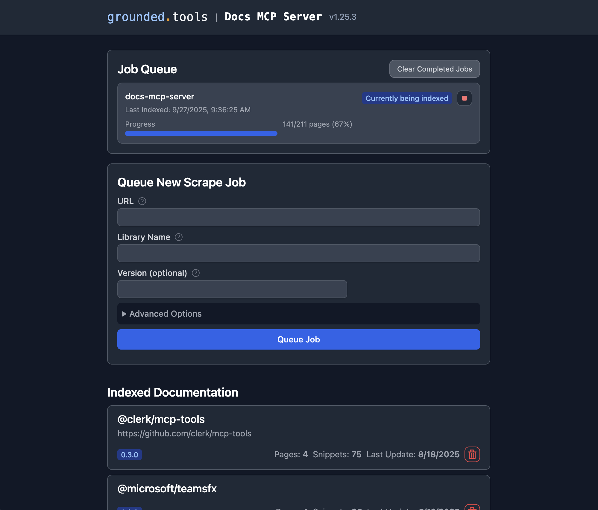

# Grounded Docs: Your AI's Up-to-Date Documentation Expert

**Docs MCP Server** solves the problem of AI hallucinations and outdated knowledge by providing a personal, always-current documentation index for your AI coding assistant. It fetches official docs from websites, GitHub, npm, PyPI, and local files, allowing your AI to query the exact version you are using.



## ✨ Why Grounded Docs MCP Server?

The open-source alternative to **Context7**, **Nia**, and **Ref.Tools**.

-   ✅ **Up-to-Date Context:** Fetches documentation directly from official sources on demand.
-   🎯 **Version-Specific:** Queries target the exact library versions in your project.
-   💡 **Reduces Hallucinations:** Grounds LLMs in real documentation.
-   🔒 **Private & Local:** Runs entirely on your machine; your code never leaves your network.
-   🧩 **Broad Compatibility:** Works with any MCP-compatible client (Claude, Cline, etc.).
-   📁 **Multiple Sources:** Index websites, GitHub repositories, local folders, and zip archives.
-   📄 **Rich File Support:** Processes HTML, Markdown, PDF, Word (.docx), Excel, PowerPoint, and source code.

---

## 🚀 Quick Start

**1. Start the server** (requires Node.js 22+):

```bash
npx @arabold/docs-mcp-server@latest
```

**2. Open the Web UI** at **[http://localhost:6280](http://localhost:6280)** to add documentation.

**3. Connect your AI client** by adding this to your MCP settings (e.g., `claude_desktop_config.json`):

```json
{
  "mcpServers": {
    "docs-mcp-server": {
      "type": "sse",
      "url": "http://localhost:6280/sse"
    }
  }
}
```

See **[Connecting Clients](docs/guides/mcp-clients.md)** for VS Code (Cline, Roo) and other setup options.

<details>
<summary>Alternative: Run with Docker</summary>

```bash
docker run --rm \
  -v docs-mcp-data:/data \
  -v docs-mcp-config:/config \
  -p 6280:6280 \
  ghcr.io/arabold/docs-mcp-server:latest \
  --protocol http --host 0.0.0.0 --port 6280
```

</details>

### 🧠 Configure Embedding Model (Recommended)

Using an embedding model is **optional** but dramatically improves search quality by enabling semantic vector search.

**Example: Enable OpenAI Embeddings**

```bash
OPENAI_API_KEY="sk-proj-..." npx @arabold/docs-mcp-server@latest
```

See **[Embedding Models](docs/guides/embedding-models.md)** for configuring **Ollama**, **Gemini**, **Azure**, and others.

---

## 📚 Documentation

### Getting Started
-   **[Installation](docs/setup/installation.md)**: Detailed setup guides for Docker, Node.js (npx), and Embedded mode.
-   **[Connecting Clients](docs/guides/mcp-clients.md)**: How to connect Claude, VS Code (Cline/Roo), and other MCP clients.
-   **[Basic Usage](docs/guides/basic-usage.md)**: Using the Web UI, CLI, and scraping local files.
-   **[Configuration](docs/setup/configuration.md)**: Full reference for config files and environment variables.
-   **[Embedding Models](docs/guides/embedding-models.md)**: Configure OpenAI, Ollama, Gemini, and other providers.

### Key Concepts & Architecture
-   **[Deployment Modes](docs/infrastructure/deployment-modes.md)**: Standalone vs. Distributed (Docker Compose).
-   **[Authentication](docs/infrastructure/authentication.md)**: Securing your server with OAuth2/OIDC.
-   **[Telemetry](docs/infrastructure/telemetry.md)**: Privacy-first usage data collection.
-   **[Architecture](ARCHITECTURE.md)**: Deep dive into the system design.

---

## 🤝 Contributing

We welcome contributions! Please see **[CONTRIBUTING.md](CONTRIBUTING.md)** for development guidelines and setup instructions.

## License

This project is licensed under the MIT License. See [LICENSE](LICENSE) for details.
