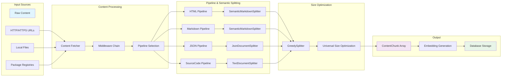

# Content Processing

## Overview

The content processing system transforms raw content from various sources into searchable document chunks through a modular pipeline architecture.

## Content Sources

### Web Sources

- HTTP/HTTPS URLs with JavaScript rendering support
- Playwright-based scraping for dynamic content
- Configurable depth and page limits
- Respect for robots.txt and rate limiting

### Local Files

- `file://` protocol for local filesystem access
- Recursive directory processing
- MIME type detection for content routing
- Support for HTML, Markdown, and text files

### Package Registries

- npm registry documentation extraction
- PyPI package documentation
- Version-specific documentation retrieval
- Package metadata integration

## Processing Pipeline

### Fetcher Layer

Abstracts content retrieval across sources:

**HttpFetcher:**

- Handles web content with Playwright
- JavaScript execution and DOM rendering
- Cookie and session management
- Retry logic and error handling

**FileFetcher:**

- Local filesystem access
- MIME type detection
- Directory traversal with filtering
- File encoding detection

### Middleware Chain

Content transforms through ordered middleware:

1. **Content Parser**: HTML/Markdown parsing
2. **Metadata Extractor**: Title, description, timestamps
3. **Link Processor**: Internal link resolution
4. **Content Cleaner**: Remove navigation, ads, boilerplate
5. **Structure Normalizer**: Consistent heading hierarchy

### Pipeline Selection

Content routes to appropriate pipeline based on MIME type:

**HtmlPipeline:**

- DOM parsing and structure extraction
- Navigation removal and content isolation
- Link context preservation
- Metadata extraction from HTML tags
- Uses SemanticMarkdownSplitter for section-aware splitting

**MarkdownPipeline:**

- Markdown parsing and structure analysis
- Code block preservation
- Link and reference processing
- Front matter extraction
- Uses SemanticMarkdownSplitter for hierarchical splitting

**JsonPipeline:**

- JSON structure analysis and hierarchical parsing
- Object and array relationship preservation
- Uses JsonDocumentSplitter for hierarchical JSON splitting

**SourceCodePipeline:**

- Programming language file processing
- Language detection from MIME types and content patterns
- Uses TextDocumentSplitter for line-based splitting (temporary until TreeSitter integration)

## Content Transformation

### HTML Processing

1. Parse DOM structure using Playwright
2. Remove navigation elements and ads
3. Extract main content areas
4. Preserve code blocks and tables
5. Convert to clean Markdown format

### Markdown Processing

1. Parse Markdown AST
2. Extract front matter metadata
3. Process code blocks and tables
4. Resolve relative links
5. Normalize heading structure

### Metadata Extraction

Common metadata across content types:

- Document title and description
- Creation and modification timestamps
- Author information
- Version and library association
- URL and source context

## Content Processing Flow

Content follows a structured pipeline from raw input to searchable chunks:



### Phase 1: Content Processing & Semantic Splitting

- **Input**: Raw HTML, Markdown, JSON, or source code
- **Processing**: Pipeline-specific processing with appropriate content splitter that understands the structure
- **Output**: ContentChunk array with content-type-specific semantic boundaries

### Phase 2: Size Optimization

- **Input**: Semantically-split chunks from specialized splitters
- **Processing**: GreedySplitter merges small chunks and handles oversized content while preserving semantic boundaries
- **Output**: Optimally-sized chunks ready for embedding generation

## Content-Type-Specific Processing

### Pipeline-Splitter Architecture

Each content type uses a specialized pipeline with an appropriate splitter:

#### Markdown Content → SemanticMarkdownSplitter

**MarkdownPipeline** handles markdown documents:

- **Heading Analysis**: Parses H1-H6 tags to build hierarchical paths
- **Content Type Detection**: Identifies text, code blocks, tables within markdown
- **Path Construction**: Creates hierarchical paths like `["Introduction", "Getting Started", "Installation"]`
- **Structure Preservation**: Maintains parent-child relationships through path prefixes

#### JSON Content → JsonDocumentSplitter

**JsonPipeline** handles JSON files:

- **Structure Analysis**: Parses JSON hierarchy and object relationships
- **Concatenation-Friendly Splitting**: Creates property-level and array-element chunks that concatenate naturally
- **Content Type**: Marks all JSON content with "code" content type
- **Structural Context**: Parent chunks provide opening/closing braces, sibling chunks include proper comma separation
- **Reassembly Design**: Chunks are designed as building blocks - siblings concatenate to form valid JSON with parent context

#### Source Code → TextDocumentSplitter

**SourceCodePipeline** handles programming language files:

- **Language Detection**: Identifies programming language from MIME types and content patterns
- **Line-based Splitting**: Simple line-based splitting with hierarchical path structure
- **Content Type**: Marks all code content with "code" content type
- **Temporary Implementation**: Uses TextDocumentSplitter until TreeSitter-based CodeDocumentSplitter implementation for syntax-aware splitting

#### HTML Content → SemanticMarkdownSplitter

**HtmlPipeline** converts HTML to markdown then processes:

- **DOM Parsing**: Extracts meaningful content from HTML structure
- **Content Cleaning**: Removes navigation, ads, and boilerplate
- **Markdown Conversion**: Converts to clean markdown for consistent processing
- **Structure Analysis**: Uses same hierarchical processing as markdown content

## Splitting Architecture Paradigms

The system uses two distinct splitting paradigms that serve different purposes. Understanding this distinction is critical for proper architecture decisions.

### DocumentSplitter vs ContentSplitter

**DocumentSplitter Interface:**

- **Input**: Raw content string with optional content type
- **Output**: `ContentChunk[]` with rich semantic metadata
- **Purpose**: Preserves document structure and hierarchical relationships
- **Use Case**: Primary splitters for content types (HTML, Markdown, JSON, Source Code)

**ContentSplitter Interface:**

- **Input**: Content string
- **Output**: `string[]` with no semantic structure
- **Purpose**: Simple string-based splitting within other splitters
- **Use Case**: Helper splitters for specific content fragments (tables, text blocks)

### When to Use Each Paradigm

**Use DocumentSplitter when:**

- Processing a complete content type (JSON files, Markdown documents, etc.)
- Need hierarchical relationships for reconstruction
- Require semantic metadata (content types, section paths)
- Building primary content processors

**Use ContentSplitter when:**

- Processing fragments within a larger document
- Need simple string splitting without metadata
- Building helper utilities for other splitters

### Output Structure Comparison

**DocumentSplitter Output (Preserves Structure):**

```typescript
{
  types: ["code"],
  content: `{
    "name": "my-package",
    "version": "1.0.0"
  }`,
  section: {
    level: 1,
    path: ["package.json", "metadata"]
  }
}
```

**ContentSplitter Output (Loses Structure):**

```typescript
[
  '// Path: package.json.metadata\n{\n  "name": "my-package",',
  '// Path: package.json.metadata\n  "version": "1.0.0"\n}',
];
```

### Architectural Principles

**Avoid Adapter Anti-Pattern**: Converting `ContentSplitter` output back to `ContentChunk[]` through adapters loses semantic information and creates fragmented content. Always prefer implementing `DocumentSplitter` directly for content-type processors.

**Design for Concatenation**: Chunks should be designed as "building blocks" that can be meaningfully concatenated for content reassembly. The search and context retrieval system relies on concatenating sibling chunks and parent context to provide coherent results. Each chunk should contribute naturally to reassembly rather than being complete and self-contained.

**Sibling-Based Reassembly Strategy**: When returning search results, the system concatenates:

- The matching chunk
- Previous and following siblings (typically 1 previous + 2 following)
- Parent chunks for structural context
- This produces readable, coherent content across all content types (markdown, JSON, source code)

## Document Splitting

### Two-Phase Splitting Architecture

The system implements a two-phase approach to content splitting:

**Phase 1: Content-Type-Specific Semantic Splitting**

- Each content type uses an appropriate splitter that understands its structure
- Preserves semantic boundaries (headings, JSON objects, code functions)
- Maintains hierarchical relationships and context

**Phase 2: Universal Size Optimization**

- GreedySplitter applies consistent size optimization across all content types
- Merges small chunks and handles oversized content while respecting semantic boundaries
- Ensures optimal chunk sizes for embedding generation and search

### Interface Architecture

The system follows a clear interface hierarchy:

**Primary Architecture**: Content-type pipelines use DocumentSplitters directly to preserve semantic structure and enable hierarchical reconstruction. This architectural principle eliminates the adapter anti-pattern and maintains semantic information throughout the processing pipeline.

**DocumentSplitter Implementations:**

- **JsonDocumentSplitter**: Direct hierarchical JSON processing without adapters
- **TextDocumentSplitter**: Simple line-based source code splitting (temporary until TreeSitter integration)
- **SemanticMarkdownSplitter**: Markdown and HTML structure-aware splitting

### Size Optimization Phase

**GreedySplitter** provides intelligent size optimization across all content types:

- **Greedy Concatenation**: Merges small chunks until reaching minimum size thresholds
- **Boundary Respect**: Preserves major section breaks and content-type boundaries
- **Metadata Merging**: Intelligently combines chunk metadata using hierarchy rules
- **Context Preservation**: Maintains relationships during optimization

### Hierarchical Path System

Each content chunk contains hierarchical metadata:

**ContentChunk Structure:**

```typescript
{
  types: ["text", "code", "table", "heading"],
  content: "...",
  section: {
    level: 2,                    // Heading depth (1-6)
    path: ["Guide", "Setup"]     // Hierarchical path
  }
}
```

**Relationship Determination:**

- **Parent**: Path with one fewer element (`["Guide"]` is parent of `["Guide", "Setup"]`)
- **Children**: Paths extending current by one level
- **Siblings**: Same path length with shared parent path
- **Context**: Related chunks automatically included in search results

### Content Type Handling

Different content types receive specialized processing through dedicated splitters:

**Text Content (via SemanticMarkdownSplitter):**

- Hierarchical splitting: paragraphs → lines → words
- Semantic boundary preservation
- Context-aware merging

**Code Content (via CodeContentSplitter):**

- Line-based splitting preserving syntax
- Language detection and formatting
- Function and class boundary respect
- Complete code context maintenance

**JSON Content (via JsonDocumentSplitter):**

- Object and array boundary preservation
- Property-based hierarchical splitting
- Structure-aware size optimization
- Direct ContentChunk generation with hierarchical paths

**Source Code (via TextDocumentSplitter):**

- Line-based splitting with language detection
- Simple hierarchical path structure
- Content type preservation for code
- Temporary implementation until TreeSitter integration for syntax-aware splitting

### Semantic Chunking

Content splits based on document structure rather than arbitrary size:

**Structure-Aware Splitting:**

- Respect heading boundaries
- Keep code blocks intact
- Preserve table structure
- Maintain list coherence

**Context Preservation:**

- Include parent heading context
- Preserve sibling relationships
- Maintain source URL attribution
- Sequential ordering for navigation

### Chunking Strategies

**GreedySplitter:**

- Universal size optimization layer applied to all content types
- Intelligent merging respecting semantic boundaries from specialized splitters
- Maximum chunk size with overflow handling
- Preserves hierarchical relationships established by content-specific splitters

**SemanticMarkdownSplitter:**

- Handles both Markdown and HTML content (HTML is converted to Markdown first)
- Heading hierarchy preservation and structure-aware chunking
- Code block and table integrity within markdown
- Context-rich chunk boundaries based on document structure

**JsonContentSplitter (via JsonDocumentSplitterAdapter):**

- JSON structure-aware splitting with object and array boundary preservation
- Property-based hierarchical chunking maintaining semantic relationships
- Adapted to work with GreedySplitter through DocumentSplitter interface

**CodeContentSplitter (via CodeDocumentSplitterAdapter):**

- Programming language syntax awareness with function and class boundary respect
- Line-based splitting with context preservation and comment documentation
- Adapted to work with GreedySplitter through DocumentSplitter interface

## Context and Relationships

### Hierarchical Context Retrieval

The system maintains rich contextual relationships between chunks:

**Automatic Context Inclusion:**

- Parent chunks provide broader context
- Child chunks offer detailed exploration
- Sibling chunks enable lateral navigation
- Sequential ordering preserves document flow

**Search Enhancement:**
When a chunk matches a search query, the system automatically includes:

- The matching chunk itself
- Its parent chunk (for broader context)
- Preceding and subsequent siblings (for navigation)
- Direct child chunks (for deeper exploration)

### Metadata Preservation

Each chunk preserves comprehensive metadata:

**Document Context:**

- Source URL and attribution
- Library and version information
- Processing timestamp and configuration

**Structural Context:**

- Hierarchical path and heading level
- Content types present in chunk
- Sequential position within document

**Search Context:**

- Relevance scores and ranking
- Related chunk references
- Cross-document relationships

## Processing Examples

### Example: Technical Documentation (Markdown)

**Input Document Structure:**

```
# API Reference
## Authentication
### OAuth Setup
#### Client Configuration
Some OAuth client setup details...
#### Server Configuration
Server-side OAuth configuration...
## Endpoints
### User Management
#### GET /users
Returns list of users...
```

**Generated Hierarchy (via SemanticMarkdownSplitter):**

```
Chunk 1: {
  path: ["API Reference"],
  level: 1,
  content: "# API Reference\n[overview content]"
}

Chunk 2: {
  path: ["API Reference", "Authentication"],
  level: 2,
  content: "## Authentication\n[auth overview]"
}

Chunk 3: {
  path: ["API Reference", "Authentication", "OAuth Setup", "Client Configuration"],
  level: 4,
  content: "#### Client Configuration\nSome OAuth client setup details..."
}
```

### Example: JSON Configuration File

**Input JSON Structure:**

```json
{
  "name": "my-package",
  "version": "1.0.0",
  "dependencies": {
    "express": "^4.18.0",
    "lodash": "^4.17.21"
  },
  "scripts": {
    "start": "node index.js",
    "test": "jest"
  }
}
```

**Generated Chunks (via JsonDocumentSplitter - Concatenation-Friendly):**

```
Chunk 1 (parent context): {
  path: ["package.json"],
  level: 1,
  content: "{"
}

Chunk 2 (property): {
  path: ["package.json", "name"],
  level: 2,
  content: "  \"name\": \"my-package\","
}

Chunk 3 (property): {
  path: ["package.json", "version"],
  level: 2,
  content: "  \"version\": \"1.0.0\","
}

Chunk 4 (property with nested object): {
  path: ["package.json", "dependencies"],
  level: 2,
  content: "  \"dependencies\": {\n    \"express\": \"^4.18.0\",\n    \"lodash\": \"^4.17.21\"\n  },"
}

Chunk 5 (property with nested object): {
  path: ["package.json", "scripts"],
  level: 2,
  content: "  \"scripts\": {\n    \"start\": \"node index.js\",\n    \"test\": \"jest\"\n  }"
}

Chunk 6 (parent closing): {
  path: ["package.json"],
  level: 1,
  content: "}"
}
```

**Reassembly Example**: If searching for "dependencies" and applying sibling strategy:

- Found chunk: Chunk 4 (dependencies property)
- Previous sibling: Chunk 3 (version property)
- Following siblings: Chunk 5 (scripts property)
- Parent context: Chunk 1 (opening brace) + Chunk 6 (closing brace)
- **Result**: Valid, readable JSON showing dependencies in context

### Example: Source Code File

**Input TypeScript Code:**

```typescript
export class UserService {
  constructor(private db: Database) {}

  async getUser(id: string): Promise<User> {
    return await this.db.users.findById(id);
  }

  async createUser(userData: CreateUserData): Promise<User> {
    return await this.db.users.create(userData);
  }
}
```

**Generated Chunks (via CodeContentSplitter):**

```
Chunk 1: {
  path: ["UserService", "Class Declaration"],
  content: "export class UserService {\n  constructor(private db: Database) {}"
}

Chunk 2: {
  path: ["UserService", "getUser"],
  content: "async getUser(id: string): Promise<User> {\n    return await this.db.users.findById(id);\n  }"
}

Chunk 3: {
  path: ["UserService", "createUser"],
  content: "async createUser(userData: CreateUserData): Promise<User> {\n    return await this.db.users.create(userData);\n  }"
}
```

**Relationship Resolution:**

- Chunk 3's parent: Chunk with path `["API Reference", "Authentication", "OAuth Setup"]`
- Chunk 3's siblings: Other chunks with 4-element paths sharing the same first 3 elements
- Chunk 2's children: All chunks with paths starting with `["API Reference", "Authentication"]`

All content types maintain hierarchical relationships through their path structures, enabling consistent context retrieval regardless of the original format.

## Content Filtering

### Noise Removal

Automatic filtering of common noise:

- Navigation menus and sidebars
- Advertisement content
- Cookie notices and popups
- Social media widgets
- Comment sections

### Content Quality

Quality assessment and filtering:

- Minimum content length thresholds
- Language detection and filtering
- Duplicate content detection
- Boilerplate text removal

## URL Context Management

### Link Resolution

Process and resolve various link types:

- Absolute URLs preserved as-is
- Relative URLs resolved against base URL
- Fragment links handled appropriately
- Invalid links logged and skipped

### URL Normalization

Consistent URL formatting:

- Protocol normalization (http/https)
- Path canonicalization
- Query parameter ordering
- Fragment handling

### Scope Management

Content scoping based on configuration:

- Same-domain restrictions
- Path prefix limitations
- Maximum depth enforcement
- URL pattern filtering

## Progress Tracking

### Processing Metrics

Track processing progress:

- Pages discovered vs processed
- Processing rate (pages/minute)
- Error count and types
- Memory usage and performance

### Real-time Updates

Progress reporting through callbacks:

- Page-level progress updates
- Status change notifications
- Error and warning reporting
- Completion estimates

## Error Handling

### Graceful Degradation

Handle various error conditions:

- Network timeouts and failures
- Invalid content format
- Parsing errors
- Memory limitations

### Error Classification

Different error handling strategies:

- **Recoverable**: Retry with backoff
- **Content**: Skip and continue
- **Fatal**: Stop processing with error
- **Warning**: Log and continue

### Error Reporting

Comprehensive error information:

- Specific error messages
- Processing context
- URL and content details
- Stack traces for debugging

## Content Optimization

### Memory Management

Efficient memory usage:

- Streaming content processing
- Chunk-based processing
- Memory-mapped files for large content
- Garbage collection optimization

### Performance Tuning

Processing optimization:

- Parallel content fetching
- Cached DOM parsing
- Efficient text processing
- Database batch operations

### Resource Limits

Configurable resource constraints:

- Maximum page size
- Processing timeout limits
- Memory usage caps
- Concurrent request limits

## Integration Points

### Embedding Generation

Content flows to embedding generation:

- Consistent chunk formatting
- Metadata preservation
- Vector dimension consistency
- Provider-specific formatting

### Storage Layer

Processed content storage:

- Normalized chunk structure
- Metadata preservation
- URL and context attribution
- Sequential ordering maintenance
