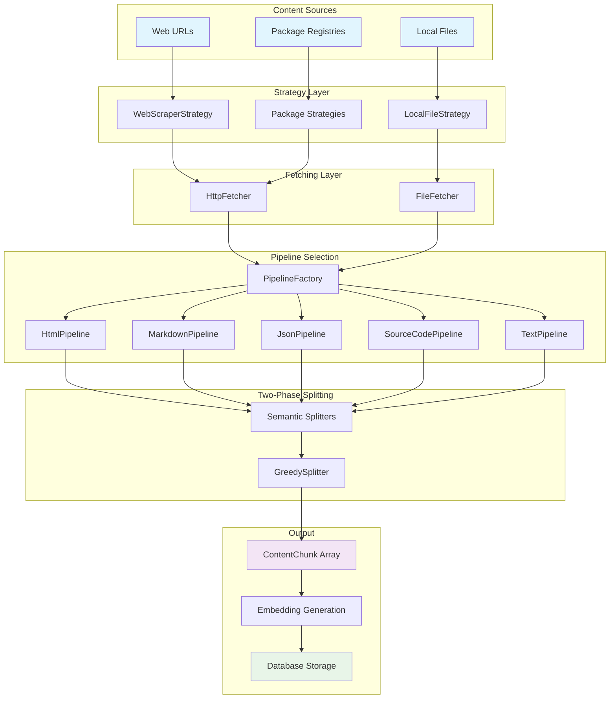
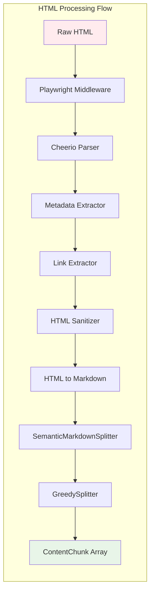
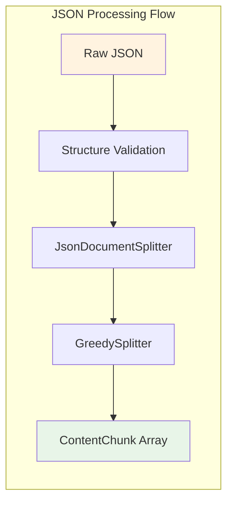
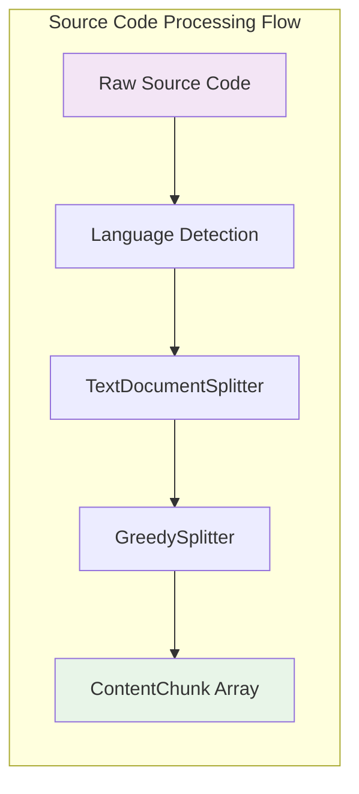

# Content Processing

## Overview

The content processing system transforms raw content from various sources into searchable document chunks through a modular strategy-pipeline-splitter architecture. The system handles web pages, local files, and package registries, processing different content types with specialized pipelines that preserve document structure while optimizing chunk sizes for embedding generation.

## Architecture Components

### Scraper Strategies

Handle different content sources and coordinate the overall scraping process:

- **WebScraperStrategy**: HTTP/HTTPS URLs with JavaScript rendering support
- **LocalFileStrategy**: Local filesystem access with directory traversal
- **NpmScraperStrategy**: npm registry package documentation
- **PyPiScraperStrategy**: PyPI package documentation
- **GitHubScraperStrategy**: GitHub repository documentation

Each strategy manages URL discovery, scope filtering, and progress tracking while delegating content processing to pipelines.

### Content Fetchers

Abstract content retrieval across different sources:

- **HttpFetcher**: Web content with Playwright support, retry logic, and error handling
- **FileFetcher**: Local filesystem access with MIME type detection and encoding resolution

### Processing Pipelines

Transform raw content using middleware chains and content-type-specific logic:

- **HtmlPipeline**: Converts HTML to clean markdown via middleware, then applies semantic splitting
- **MarkdownPipeline**: Processes markdown with metadata extraction and semantic splitting
- **JsonPipeline**: Validates JSON structure and applies hierarchical splitting
- **SourceCodePipeline**: Handles programming languages with language detection and line-based splitting
- **TextPipeline**: Fallback for generic text content with basic processing

### Middleware System

Transform content through ordered middleware chains within pipelines:

**HTML Middleware Stack:**

1. **HtmlPlaywrightMiddleware**: Dynamic content rendering (optional)
2. **HtmlCheerioParserMiddleware**: DOM parsing and structure extraction
3. **HtmlMetadataExtractorMiddleware**: Title, description, and metadata extraction
4. **HtmlLinkExtractorMiddleware**: Link discovery and resolution
5. **HtmlSanitizerMiddleware**: Remove navigation, ads, and boilerplate
6. **HtmlToMarkdownMiddleware**: Convert to clean markdown format

**Markdown Middleware Stack:**

1. **MarkdownMetadataExtractorMiddleware**: Front matter and metadata extraction
2. **MarkdownLinkExtractorMiddleware**: Link processing and resolution

**JSON and Source Code**: Minimal middleware for structure preservation

### Document Splitters

Segment content into semantic chunks while preserving document structure:

- **SemanticMarkdownSplitter**: Hierarchy-aware splitting based on heading structure
- **JsonDocumentSplitter**: Property-based hierarchical splitting for JSON files
- **TextDocumentSplitter**: Line-based splitting for source code and plain text

### Size Optimization

**GreedySplitter** provides universal size optimization across all content types:

- Merges small chunks until reaching minimum size thresholds
- Respects semantic boundaries from content-specific splitters
- Handles oversized content while preserving document structure
- Ensures optimal chunk sizes for embedding generation

## Content Processing Flow



## Content-Type-Specific Processing

### HTML Content Processing (Web Scraping)



**Process:**

1. Optional Playwright rendering for dynamic content
2. DOM parsing and structure extraction
3. Metadata extraction from HTML tags
4. Link discovery and scope filtering
5. Content cleaning (remove navigation, ads)
6. Conversion to clean markdown format
7. Hierarchical splitting based on heading structure
8. Size optimization while preserving semantic boundaries

### JSON File Processing (Local Files)



**Process:**

1. JSON structure validation and parsing
2. Hierarchical splitting based on object/array structure
3. Property-level chunk creation with proper paths
4. Size optimization maintaining JSON hierarchy

### Source Code Processing



**Process:**

1. Programming language detection from MIME type
2. Line-based splitting with hierarchical paths
3. Size optimization preserving code structure
4. Future: TreeSitter-based syntax-aware splitting

## Two-Phase Splitting Architecture

### Phase 1: Semantic Splitting

Content-type-specific splitters preserve document structure:

**SemanticMarkdownSplitter** (HTML, Markdown):

- Analyzes heading hierarchy (H1-H6)
- Creates hierarchical paths like `["Guide", "Installation", "Setup"]`
- Preserves code blocks, tables, and list structures
- Maintains parent-child relationships

**JsonDocumentSplitter** (JSON):

- Object and property-level splitting
- Hierarchical path construction
- Concatenation-friendly chunk design
- Structural context preservation

**TextDocumentSplitter** (Source Code, Text):

- Line-based splitting with context
- Simple hierarchical structure
- Language-aware processing
- Temporary until syntax-aware implementation

### Phase 2: Size Optimization

**GreedySplitter** applies universal optimization:

```typescript
// Size optimization while preserving semantic boundaries
const chunks = await greedySplitter.splitText(semanticChunks);
```

- **Greedy Concatenation**: Merges small chunks until minimum size
- **Boundary Respect**: Preserves major section breaks (H1/H2 headings)
- **Metadata Merging**: Combines chunk metadata intelligently
- **Context Preservation**: Maintains hierarchical relationships

## Chunk Structure and Relationships

### ContentChunk Format

```typescript
{
  types: ["text", "code", "table"],  // Content types present
  content: "...",                    // Actual content text
  section: {
    level: 2,                        // Heading depth (1-6)
    path: ["Guide", "Setup"]         // Hierarchical path
  }
}
```

### Hierarchical Relationships

- **Parent**: Path with one fewer element
- **Children**: Paths extending current by one level
- **Siblings**: Same path length with shared parent
- **Context**: Related chunks automatically included in search results

### Search Context Retrieval

When returning search results, the system provides comprehensive context:

- The matching chunk itself
- Parent chunks for broader context
- Previous and following siblings for navigation
- Direct child chunks for deeper exploration

This approach ensures users receive coherent, contextual results regardless of content type.

## Content Examples

### Markdown Document Processing

**Input Structure:**

```markdown
# API Reference

## Authentication

### OAuth Setup

#### Client Configuration

OAuth client setup details...

#### Server Configuration

Server-side OAuth configuration...
```

**Generated Chunks:**

```typescript
[
  {
    types: ["heading"],
    content: "# API Reference",
    section: { level: 1, path: ["API Reference"] },
  },
  {
    types: ["heading", "text"],
    content: "## Authentication\nAuthentication overview...",
    section: { level: 2, path: ["API Reference", "Authentication"] },
  },
  {
    types: ["heading", "text"],
    content: "#### Client Configuration\nOAuth client setup details...",
    section: {
      level: 4,
      path: [
        "API Reference",
        "Authentication",
        "OAuth Setup",
        "Client Configuration",
      ],
    },
  },
];
```

### JSON File Processing

**Input JSON:**

```json
{
  "name": "my-package",
  "version": "1.0.0",
  "dependencies": {
    "express": "^4.18.0",
    "lodash": "^4.17.21"
  }
}
```

**Generated Chunks:**

```typescript
[
  {
    types: ["code"],
    content: "{",
    section: { level: 1, path: ["package.json"] },
  },
  {
    types: ["code"],
    content: '  "name": "my-package",',
    section: { level: 2, path: ["package.json", "name"] },
  },
  {
    types: ["code"],
    content:
      '  "dependencies": {\n    "express": "^4.18.0",\n    "lodash": "^4.17.21"\n  },',
    section: { level: 2, path: ["package.json", "dependencies"] },
  },
  {
    types: ["code"],
    content: "}",
    section: { level: 1, path: ["package.json"] },
  },
];
```

### Source Code Processing

**Input TypeScript:**

```typescript
export class UserService {
  async getUser(id: string): Promise<User> {
    return await this.db.users.findById(id);
  }
}
```

**Generated Chunks:**

```typescript
[
  {
    types: ["code"],
    content: "export class UserService {",
    section: { level: 1, path: ["UserService.ts", "UserService"] },
  },
  {
    types: ["code"],
    content:
      "  async getUser(id: string): Promise<User> {\n    return await this.db.users.findById(id);\n  }",
    section: { level: 2, path: ["UserService.ts", "UserService", "getUser"] },
  },
];
```

## Error Handling and Quality Control

### Content Filtering

Automatic filtering of low-quality content:

- Navigation menus and sidebars
- Advertisement content and widgets
- Boilerplate text and templates
- Duplicate content detection
- Minimum content length thresholds

### Error Recovery

Graceful handling of processing errors:

- **Recoverable Errors**: Retry with backoff
- **Content Errors**: Skip and continue processing
- **Fatal Errors**: Stop with detailed error information
- **Warning Conditions**: Log and continue

### Progress Tracking

Real-time processing feedback:

- Page-level progress updates
- Processing rate metrics
- Error count and classification
- Memory usage monitoring

## Integration Points

### Embedding Generation

Processed chunks flow to embedding generation:

- Consistent chunk formatting across content types
- Metadata preservation for search enhancement
- Provider-specific formatting (OpenAI, Google, Azure, AWS)
- Vector dimension consistency

### Storage Layer

Database storage maintains relationships:

- Hierarchical path indexing
- Content type classification
- URL and source attribution
- Search optimization indexes

### Search and Retrieval

Context-aware search results:

- Vector similarity matching
- Hierarchical context inclusion
- Cross-document relationship preservation
- Relevance scoring and ranking
