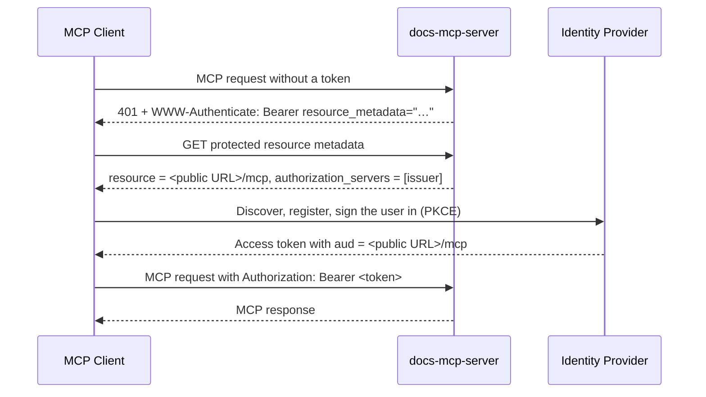

# Authentication

## Overview

The Docs MCP Server can require an OAuth 2.0 access token on its MCP endpoint. Authentication is off by default, so local use stays frictionless.

When enabled, the server is an OAuth 2.0 **resource server**. It does not issue tokens, register clients, or host sign-in pages. An external identity provider (Clerk, Auth0, Keycloak, Microsoft Entra ID, and others) does all of that. MCP clients discover the provider from the server, sign the user in there, and send the token they receive with every request. The server accepts a token only when it is a JWT that the configured provider issued for this server.

This follows the [MCP authorization specification](https://modelcontextprotocol.io/specification/2026-07-28/basic/authorization) (protocol revision 2026-07-28).

## What Authentication Protects

| Surface | Protected by authentication | How to protect it |
|---|---|---|
| MCP endpoint (`/mcp`) over HTTP | **Yes** | Bearer token, as described here |
| Deprecated SSE transport (`/sse`, `/messages`) | Not served | Only available while authentication is off |
| MCP over stdio | No | The host that launches the process is the trust boundary. Enabling auth logs a warning. |
| Web UI | No | A reverse proxy with its own sign-in (OAuth2-Proxy, Authelia, Traefik forward-auth, Cloudflare Access), or a private network |
| HTTP API (`/api`) and its WebSocket | No | Same as the web UI. On a loopback bind the server also rejects requests from foreign browser origins. |
| Worker link (`--server-url`) | No | A private network between coordinator and worker |

At startup the server states this boundary, naming the protected MCP endpoint. When authentication is enabled on a command that serves no MCP endpoint over HTTP (`web`, `worker`), it warns that authentication protects nothing in that process.

For putting the web UI and API behind a reverse proxy, see [Reverse Proxy Deployment](./reverse-proxy.md).

## How Clients Authenticate



1. **Challenge.** A request without a valid token gets `401` with `WWW-Authenticate: Bearer resource_metadata="<public URL>/.well-known/oauth-protected-resource/mcp"`. When the request carried a token that was rejected, the challenge also carries `error="invalid_token"`.
2. **Metadata.** The protected resource metadata (RFC 9728) names the MCP endpoint's public URL as `resource` and the configured issuer as the only authorization server. It is served at the URL in the challenge and at the RFC 9728 well-known location, and it is readable from any origin.
3. **Sign-in.** The client talks to the provider directly. It asks for a token for the `resource` it just learned, per RFC 8707.
4. **Requests.** The client sends `Authorization: Bearer <token>` on every request.

## Configuration

| Setting | CLI | Environment | Required | Description |
|---|---|---|---|---|
| `auth.enabled` | `--auth-enabled` | `DOCS_MCP_AUTH_ENABLED` | – | Turns authentication on for the MCP endpoint. |
| `auth.issuerUrl` | `--auth-issuer-url` | `DOCS_MCP_AUTH_ISSUER_URL` | yes | The provider's issuer identifier. It must match the `issuer` the provider publishes exactly, including any trailing slash. |
| `server.publicUrl` | `--public-url` | `DOCS_MCP_SERVER_PUBLIC_URL` | yes | The URL clients use to reach the server, e.g. `https://docs.example.com` or `https://example.com/docs`. |
| `auth.audience` | `--auth-audience` | `DOCS_MCP_AUTH_AUDIENCE` | no | The audience tokens must carry. It defaults to `<public URL>/mcp`. |

The advertised `resource` and the expected audience both derive from `server.publicUrl`. The server never guesses them from its bind address or from the request's `Host` header. That is why a public URL is required, and startup fails with an error naming the missing setting.

```bash
npx @arabold/docs-mcp-server@latest \
  --auth-enabled \
  --auth-issuer-url "https://your-app.clerk.accounts.dev" \
  --public-url "https://docs.example.com"
```

Tokens must then carry `aud` = `https://docs.example.com/mcp`.

At startup the server discovers the provider's metadata in the order MCP clients use:

1. RFC 8414 with path insertion;
2. OpenID Connect Discovery with path insertion;
3. OpenID Connect Discovery with the path appended.

Startup fails when no document answers, when the published `issuer` differs from `auth.issuerUrl`, or when the metadata has no `jwks_uri`.

## Identity Provider Requirements

Whatever provider you use, it needs to:

- **Issue JWT access tokens** signed with keys published in its `jwks_uri`. The server rejects opaque tokens.
- **Put this server in `aud`.** Ideally the provider sets `aud` from the RFC 8707 `resource` parameter the client sends, which is `<public URL>/mcp`. A provider that issues a fixed audience works too: set `auth.audience` to that value. The override must name an API or resource identifier, never a client ID, or the provider's ID tokens would be accepted as access tokens.
- **Let MCP clients register themselves**, through Client ID Metadata Documents (preferred in MCP 2026-07-28) or Dynamic Client Registration (RFC 7591).
- **Support PKCE with S256.**

### Clerk

Enable these OAuth application settings on the Clerk instance:

| Setting | Value | Why |
|---|---|---|
| JWT access tokens (`oauth_jwt_access_tokens`) | on | Clerk issues opaque tokens otherwise |
| `aud` claim (`aud_claim_enabled`) | on | Clerk sets `aud` to the requested `resource` |
| PKCE required (`pkce_required`) | on | MCP clients always use PKCE |
| Dynamic client registration | on | Lets MCP clients register themselves |
| Client ID Metadata Documents (`client_id_metadata_documents_advertised`) | recommended | The registration method MCP 2026-07-28 prefers |

With the [Clerk CLI](https://clerk.com/docs/cli):

```bash
clerk api /instance/oauth_application_settings --app <app_id> --instance dev \
  -X PATCH -d '{"oauth_jwt_access_tokens":true,"aud_claim_enabled":true,"pkce_required":true}'
```

Then run the server with `--auth-issuer-url https://<your-app>.clerk.accounts.dev` and your public URL. You don't need `auth.audience`.

## Token Validation

The server accepts a request only when its bearer token:

- is a JWT signed with a key the configured issuer publishes,
- has `iss` equal to the configured issuer,
- has an `aud` that contains the expected audience,
- and has not expired.

There is no other path to access. A token issued for another application on the same provider is rejected, and so is any opaque token. If the provider's keys can't be retrieved, the request fails with `500` rather than `401`, so clients don't restart sign-in because of a provider outage.

Access is binary: any valid token for this server grants every MCP tool.

## Troubleshooting

**Startup fails with "no public URL is configured".** Set `server.publicUrl` (or `--public-url`) to the URL clients use.

**Startup fails because `auth.issuerUrl` "does not match the issuer the authorization server publishes".** Copy the `issuer` value from the provider's metadata exactly. A trailing slash counts.

**Clients get `401` with `error="invalid_token"`.** Decode the token (for example at [jwt.io](https://jwt.io)) and compare:
- `aud` should equal `<public URL>/mcp`, or `auth.audience` if you set one;
- `iss` should equal `auth.issuerUrl`;
- `exp` should be in the future.

With Clerk, a missing `aud` or an opaque token means the settings above aren't enabled.

**A client can't find the provider.** Check that the `resource_metadata` URL from the challenge is reachable from the client. Behind a reverse proxy it must pass through: see [Reverse Proxy Deployment](./reverse-proxy.md).

**Debug logging.** Run with `--verbose` to see token verification failures.

## Security Considerations

- Serve the MCP endpoint over HTTPS in production, typically through TLS termination at a reverse proxy.
- The MCP endpoint rejects browser requests from origins other than loopback, the public URL's origin, and `server.allowedOrigins`. List hosted browser-based MCP clients there.
- Every request whose `Host` header names an unknown host is refused with `403`, which stops DNS rebinding. The server answers to IP addresses, `localhost`, single-label names such as Docker service names, the public URL's host, and the hosts of `server.allowedOrigins`.
- Authentication controls who may call MCP tools. It does not restrict where scraping may connect: outbound requests follow `scraper.security`. See [Infrastructure Security](./security.md).
