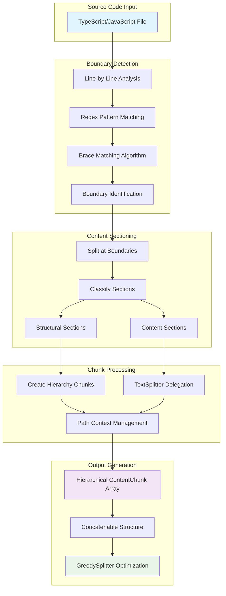
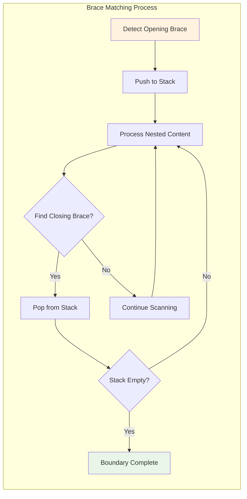
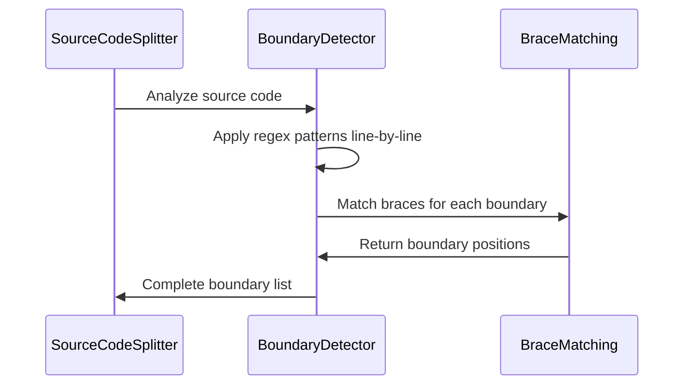
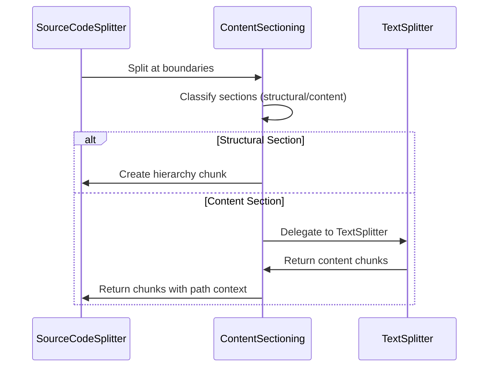
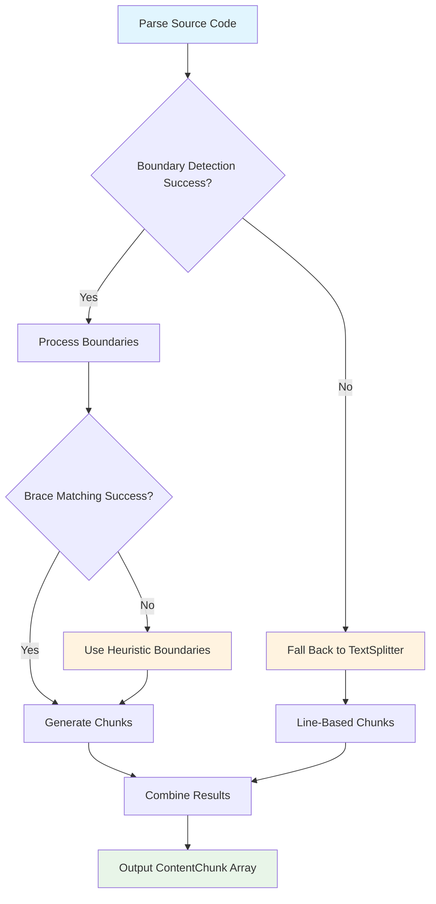
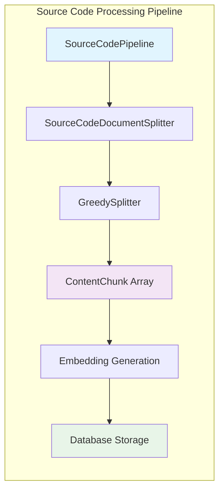

# Source Code Splitter Architecture

## Overview

The Source Code Splitter transforms source code files into hierarchical, concatenable chunks that preserve code structure while enabling effective semantic search. The system uses a boundary detection approach combined with content delegation to create minimal building-block chunks that can be reassembled through concatenation.

## Design Philosophy

### Boundary Detection + Content Delegation

Rather than attempting to parse entire source files with regex, the splitter focuses on detecting structural boundaries (classes, functions, methods) and delegates content processing to the existing `TextDocumentSplitter`. This approach provides:

- **Simplicity**: Boundary detection is much simpler than full parsing
- **Robustness**: Leverages proven TextSplitter logic for content handling
- **Maintainability**: Clear separation of concerns between structure and content
- **Extensibility**: Easy to add support for additional programming languages

### Concatenable Chunks

Following the pattern established by `JsonDocumentSplitter`, each chunk is designed as a building block:

- Opening chunks: Class/function declarations
- Content chunks: Method bodies, loose code, comments
- Closing chunks: Closing braces with proper indentation
- Hierarchical paths: Enable proper reassembly and context understanding

## Architecture Components



## Core Components

### 1. Boundary Detection Engine

The boundary detection engine identifies structural elements in source code using regex patterns optimized for TypeScript and JavaScript.

#### Supported Constructs

**Primary Boundaries:**

- **Classes**: `class ClassName { ... }`
- **Namespaces**: `namespace NamespaceName { ... }`
- **Functions**: `function functionName() { ... }`
- **Methods**: `methodName() { ... }` (within classes)
- **Interfaces**: `interface InterfaceName { ... }`
- **Type Definitions**: `type TypeName = { ... }`

**Detection Patterns:**

```typescript
const BOUNDARY_PATTERNS = {
  class: /^(\s*)(export\s+)?(abstract\s+)?class\s+(\w+)/,
  namespace: /^(\s*)(export\s+)?namespace\s+(\w+)/,
  function: /^(\s*)(export\s+)?(async\s+)?function\s+(\w+)/,
  method: /^(\s*)(\w+)\s*\([^)]*\)\s*[:{]/,
  interface: /^(\s*)(export\s+)?interface\s+(\w+)/,
  type: /^(\s*)(export\s+)?type\s+(\w+)\s*=/,
};
```

#### Boundary Structure

```typescript
interface Boundary {
  type: "class" | "namespace" | "function" | "method" | "interface" | "type";
  name: string;
  startLine: number;
  endLine: number;
  indentLevel: number;
  modifiers: string[]; // export, async, abstract, etc.
}
```

### 2. Brace Matching Algorithm

A stack-based algorithm tracks opening and closing braces to determine the exact boundaries of code blocks:



**Features:**

- Handles nested braces correctly
- Ignores braces within string literals and comments
- Tracks indentation levels for proper chunk formatting
- Recovers gracefully from malformed code

### 3. Content Sectioning

Once boundaries are identified, the source code is divided into sections:

#### Section Types

```typescript
type Section = {
  type: "structural" | "content";
  content: string;
  boundary?: Boundary;
  startLine: number;
  endLine: number;
  indentLevel: number;
};
```

**Structural Sections:**

- Class/namespace/interface declarations
- Function signatures
- Opening and closing braces
- Generate hierarchy chunks with proper paths

**Content Sections:**

- Method bodies
- Loose code between structures
- Comments and documentation
- Delegated to TextDocumentSplitter for processing

### 4. Hierarchical Path Management

Each chunk receives a hierarchical path that enables proper reassembly and context understanding:

```typescript
// Path Examples:
["UserService.ts"][("UserService.ts", "UserService")][ // File root // Class
  ("UserService.ts", "UserService", "opening")
][("UserService.ts", "UserService", "getUser")][ // Class opening brace // Method
  ("UserService.ts", "UserService", "closing")
][("UserService.ts", "Auth", "validateToken")]; // Class closing brace // Namespace function
```

**Path Construction Rules:**

- Root level: filename
- Each structural boundary adds a path segment
- Opening/closing chunks add "opening"/"closing" suffix
- Content chunks inherit the path of their containing structure

## Processing Flow

### 1. Boundary Detection Phase



### 2. Content Sectioning Phase



### 3. Chunk Generation

The final phase creates `ContentChunk` objects following the established pattern:

```typescript
// Example output for: class UserService { getUser(id) { return db.find(id); } }

[
  {
    types: ["code"],
    content: "class UserService {",
    section: {
      level: 2,
      path: ["UserService.ts", "UserService", "opening"],
    },
  },
  {
    types: ["code"],
    content: "  getUser(id) {\n    return db.find(id);\n  }",
    section: {
      level: 3,
      path: ["UserService.ts", "UserService", "getUser"],
    },
  },
  {
    types: ["code"],
    content: "}",
    section: {
      level: 2,
      path: ["UserService.ts", "UserService", "closing"],
    },
  },
];
```

## Implementation Strategy

### Phase 1: Core Infrastructure

1. **Create `SourceCodeDocumentSplitter`** implementing `DocumentSplitter` interface
2. **Implement boundary detection** with TypeScript/JavaScript regex patterns
3. **Add brace matching algorithm** for accurate boundary determination
4. **Create section classification logic** (structural vs content)

### Phase 2: Content Processing

1. **Implement hierarchical path management** system
2. **Create TextSplitter integration** for content delegation
3. **Add chunk generation logic** following concatenable pattern
4. **Implement comment preservation** mechanisms

### Phase 3: Integration & Testing

1. **Update `SourceCodePipeline`** to use new splitter
2. **Add comprehensive test suite** covering various TypeScript/JavaScript patterns
3. **Test integration** with `GreedySplitter` optimization
4. **Validate concatenability** of generated chunks

### Phase 4: Language Extension

1. **Design language-agnostic interfaces** for future extensibility
2. **Create pattern registry system** for easy language addition
3. **Document extension points** for additional programming languages

## Error Handling & Fallback Strategy

### Graceful Degradation

The splitter handles various error conditions gracefully:

1. **Malformed Code**: Falls back to `TextDocumentSplitter` for problematic sections
2. **Unmatched Braces**: Uses heuristics to determine likely boundaries
3. **Complex Nested Structures**: Limits recursion depth and delegates to TextSplitter
4. **Unknown Patterns**: Treats unrecognized code as content sections

### Recovery Mechanisms



## Language Extensibility

### Current Support: TypeScript/JavaScript

The initial implementation focuses on TypeScript and JavaScript with these constructs:

- ES6+ classes with methods and properties
- Functions (regular, async, arrow functions for top-level declarations)
- Namespaces and modules
- Interfaces and type definitions
- Import/export statements (treated as content)

### Future Language Support

The architecture supports extension to other languages by:

1. **Adding language-specific regex patterns** to the boundary detection engine
2. **Implementing language-specific brace matching rules** (if different from C-style)
3. **Extending the TextSplitter** for language-specific content handling
4. **Adding language detection logic** to route files to appropriate processors

**Planned Languages:**

- Java (classes, methods, packages)
- C# (classes, methods, namespaces, properties)
- Python (classes, functions, indentation-based blocks)
- Go (packages, functions, structs, methods)

## Integration with Existing System

### Pipeline Integration

The `SourceCodeDocumentSplitter` integrates seamlessly with the existing content processing pipeline:



### Backward Compatibility

The splitter maintains compatibility with existing interfaces:

- Implements standard `DocumentSplitter` interface
- Produces `ContentChunk` objects compatible with `GreedySplitter`
- Maintains hierarchical path structure for search context
- Preserves formatting and comments as required

## Benefits & Outcomes

### For Search Quality

1. **Structural Context**: Chunks maintain awareness of their position in code hierarchy
2. **Granular Retrieval**: Methods and functions can be retrieved individually
3. **Context Preservation**: Related chunks (class and its methods) are linked through paths
4. **Comment Association**: Documentation stays with relevant code sections

### For System Performance

1. **Efficient Processing**: Boundary detection is faster than full AST parsing
2. **Memory Efficient**: Processes code line-by-line without building large parse trees
3. **Scalable**: Linear complexity with respect to file size
4. **Robust**: Graceful degradation prevents processing failures

### For Developer Experience

1. **Accurate Results**: Search results respect code structure boundaries
2. **Complete Context**: Retrieved chunks include necessary surrounding context
3. **Maintainable**: Clear separation makes the system easy to extend and debug
4. **Reliable**: Fallback mechanisms ensure consistent operation
