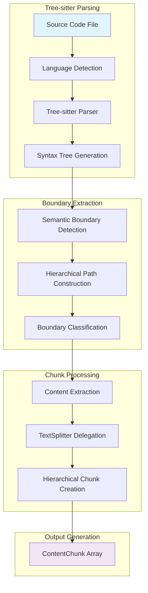
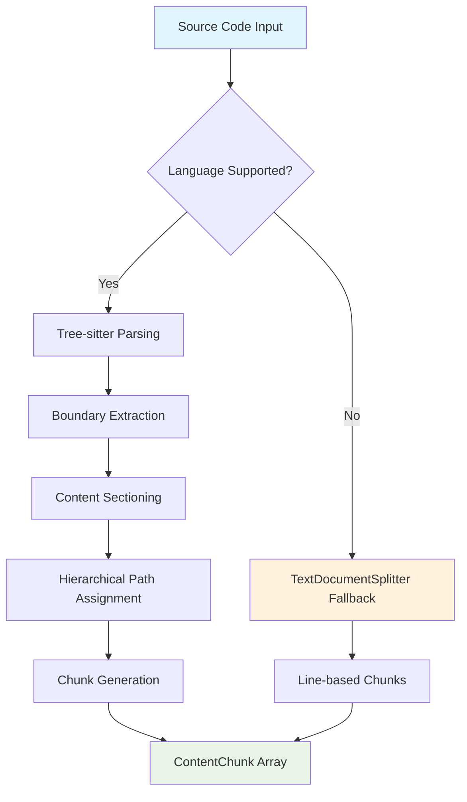
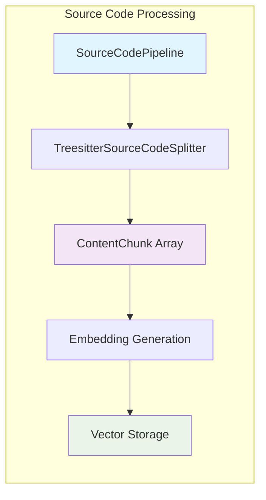

# Source Code Splitter Architecture

## Overview

The Source Code Splitter transforms source code files into hierarchical, concatenable chunks that preserve semantic structure while enabling effective code search. The system uses tree-sitter for precise syntax tree parsing to detect semantic boundaries, creating context-aware chunks that respect language structure.

## Design Philosophy

### Tree-sitter Semantic Boundaries

The splitter uses tree-sitter parsers to identify semantic boundaries in source code, providing:

- **Precision**: Syntax tree analysis ensures accurate boundary detection
- **Language Awareness**: Native support for JavaScript, TypeScript, JSX, and TSX
- **Semantic Chunking**: One chunk per function/method/class with proper hierarchy
- **Hierarchical Structure**: Chunks maintain proper nesting relationships

### Documentation-Focused Chunking

The chunking strategy prioritizes indexing public interfaces and maintaining comment-signature relationships:

- **Public Interface Emphasis**: Captures outward-facing class methods and top-level functions
- **Comment Preservation**: Documentation comments stay with their associated code
- **Hierarchical Paths**: Enable semantic search within code structure
- **Concatenable Chunks**: Chunks can be reassembled to reconstruct original context

## Architecture Components

## Core Components

### 1. Tree-sitter Language Parsers

The system supports multiple languages through dedicated tree-sitter parsers:

**Supported Languages:**

- **JavaScript**: ES6+ classes, functions, arrow functions, JSX elements
- **TypeScript**: Interfaces, types, enums, namespaces, decorators, generics, TSX
- **JSX/TSX**: React component parsing with TypeScript integration

**Language Registry:**
The `LanguageParserRegistry` automatically selects the appropriate parser based on file extension and content analysis, falling back to `TextDocumentSplitter` for unsupported languages.

### 2. Semantic Boundary Detection

Tree-sitter parsers identify structural elements through syntax tree traversal:

**Primary Boundaries:**

- **Classes**: Complete class definitions with all members
- **Functions**: Top-level function declarations and expressions
- **Methods**: Class and interface method definitions
- **Interfaces**: TypeScript interface declarations
- **Namespaces**: TypeScript namespace blocks
- **Types**: Type alias definitions

**Boundary Extraction:**
Each boundary includes start/end positions, basic type classification, and optional name for context. The system focuses on structural boundaries rather than detailed metadata extraction.

### 3. Hierarchical Chunking Strategy

The chunking approach creates semantic units that respect code structure:

**Chunking Rules:**

- **Level 1**: Top-level elements (classes, functions, interfaces, namespaces)
- **Level 2**: Class members (methods, properties, constructor)
- **Level 3**: Nested namespace elements
- **Content Delegation**: Large method bodies delegated to `TextDocumentSplitter`
- **Documentation Start Alignment**: Boundary start line always includes contiguous preceding documentation/comments (even across transparent wrappers like `export`)

### 4. Content Processing Pipeline

## Processing Flow

### Semantic Chunking Process

### Chunk Generation Strategy

The system creates chunks that balance semantic meaning with search effectiveness:

**Chunk Types:**

- **Structural Chunks**: Class/function/interface signatures with documentation
- **Method Chunks**: Complete method implementations including comments
- **Content Chunks**: Code sections between structural boundaries
- **Delegated Chunks**: Large content sections processed by TextSplitter

**Path Inheritance:**
Each chunk inherits the hierarchical path of its containing structure, enabling context-aware search and proper reassembly.

## Error Handling & Fallback Strategy

### Graceful Degradation

The splitter handles various scenarios through layered fallback mechanisms:

**Fallback Scenarios:**

- **Unsupported Languages**: Automatic delegation to TextDocumentSplitter
- **Parse Errors**: Graceful fallback for malformed syntax
- **Boundary Detection Failures**: Line-based processing for complex edge cases

### Error Recovery

The system maintains robust operation through:

- **Parse Error Isolation**: Errors in one section don't affect others
- **Content Preservation**: All source content is retained in chunks
- **Consistent Interface**: All fallback paths produce compatible ContentChunk arrays

## Language Extensibility

### Current Language Support

The tree-sitter implementation provides comprehensive support for web development languages:

**JavaScript (ES6+):**

- Classes with methods and properties
- Functions (regular, async, arrow functions for top-level declarations)
- JSX elements and React components
- Import/export statements

**TypeScript:**

- All JavaScript features plus type system constructs
- Interfaces and type alias definitions
- Namespaces and modules
- Enums and decorators
- Generic type parameters
- TSX (TypeScript + JSX)

### Architecture for Extension

The modular design supports future language additions through:

**Parser Registry System:**

- Automatic language detection by file extension
- Fallback mechanisms for unsupported languages
- Consistent interface across all language parsers

**Tree-sitter Integration:**

- Leverages existing tree-sitter grammar ecosystem
- Language-specific parsers implement common boundary extraction interface
- Shared infrastructure for syntax tree traversal and boundary detection

**Future Language Candidates:**

- Python (classes, functions, indentation-aware parsing)
- Java (packages, classes, methods)
- C# (namespaces, classes, properties, methods)
- Go (packages, structs, methods, functions)

## Integration with Pipeline System

### Source Code Processing Pipeline

The tree-sitter splitter integrates seamlessly with the existing content processing infrastructure:

### Rationale: Omission of Greedy Size-Based Merging

The previous design showed an additional GreedySplitter phase for size normalization. This has been intentionally removed for source code because:

- Structural Fidelity: Treesitter-derived chunks encode precise `{level, path}` hierarchies required for hierarchical reassembly and subtree reconstruction. Greedy merging collapses boundaries and degrades that signal.
- Retrieval Quality: HierarchicalAssemblyStrategy relies on intact structural units (class, method, function). Artificially merged aggregates reduce precision and introduce unrelated code into a match context.
- Reassembly Guarantees: The splitter already guarantees concatenability. Additional size-based merging provides negligible token efficiency gains compared to the semantic loss.
- JSON / Structured Parity: The same reasoning applies to JSON and other strictly nested formats—each structural node is meaningful even if its textual size is small.
- Simplicity & Predictability: A single semantic splitter reduces mental overhead, improves test determinism, and avoids edge cases where mixed-level metadata must be reconciled.

If future optimization is needed, it should be: (a) post-retrieval context window packing, or (b) language-aware micro-chunk collapsing that preserves explicit structural node boundaries—never generic greedy adjacency merging.

### System Benefits

**Enhanced Search Quality:**

- Semantic chunks respect code structure boundaries
- Hierarchical paths enable context-aware retrieval
- Documentation comments stay associated with relevant code
- Function and method retrieval maintains complete context

**Performance Characteristics:**

- Tree-sitter parsing provides linear time complexity
- Memory efficient processing without large intermediate structures
- Robust error handling prevents pipeline failures
- Maintains compatibility with existing chunk optimization systems

**Developer Experience:**

- Search results respect semantic boundaries
- Retrieved chunks include necessary surrounding context
- Hierarchical structure aids in understanding code relationships
- Consistent interface with other document processing pipelines
